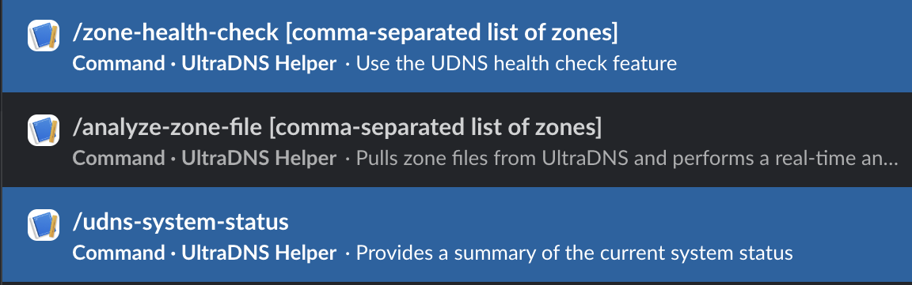

# udns_slackbot

A Slack bot that uses OpenAI's beta Assistant functionality to provide feedback on DNS zone files and answer DNS-related questions. It integrates directly with UltraDNS's API to download zone files and health checks from your account, offering actionable suggestions and insights.

## Setup

### Environment

There's an example `.env` file in `example.env`.

#### Slack Setup

To set up Slack integration, follow these steps:

1. Go to [Slack API Apps](https://api.slack.com/apps) and create a new app.
2. Obtain the necessary tokens:
    * **OAuth & Permissions**
        - Add the following bot scopes: `app_mentions:read`, `channels:history`, `channels:join`, `channels:read`, `chat:write`, `commands` and `reactions:write`
        - Install the bot to your workspace and copy the OAuth token. Use this for the `SLACK_BOT_TOKEN` value in the `.env` file
    * **Event Subscriptions**
        - Subscripe to bot events
        - Add the events `app_mention` and `message.channels`
    * **Socket Mode**
        - Enable socket mode
        - Copy the app-level token and use this for the `SLACK_APP_TOKEN` value
    * **Slash Commands**
        - Create two slash commands: `/analyze-zone-file` and `/zone-health-check`
        - The command descriptions and hints can be customized to suit your needs.

#### OpenAI Setup

1. Go to [OpenAI API Keys](https://platform.openai.com/settings/organization/api-keys)
2. Create an API key and use it as the `OPENAI_KEY` value in the `.env` file

#### UltraDNS Setup

Use the same credentials you use to log in to the UltraDNS web portal for the `ULTRADNS_USERNAME` and `ULTRADNS_PASSWORD` values in the `.env` file.

### Docker

1. Install Docker
2. Build and run the bot container with:

    ```sh
    docker compose up --build -d
    ```

    - The `compose` command specifies the use of the `docker-compose.yml` manifest
    - The `--build` flag builds the container using the `Dockerfile`
    - The `-d` flag runs the container as a daemon (in the background)

#### Logs

To view Docker logs, use:

```sh
docker compose logs -f
```

The `-f` flag puts the logs in "follow" mode, updating them in real time.

## Slack Usage

Invite your bot to a channel.

### Asking a DNS question

Mention (`@`) the bot in a channel and ask a DNS-related question. The bot will respond only to DNS-specific questions and will ignore unrelated queries.


### Slash commands

The bot currently supports two slash commands: `/analyze-zone-file` and `/zone-health-check`



#### Analyzing a zone file

Use the `/analyze-zone-file [comma-separated list of zones]` command to export the BIND file(s) from your UltraDNS account. The bot will provide configuration feedback based on the exported files.


#### Performing a zone health check

Use the `/zone-health-check [comma-separated list of zones]` command to leverage UltraDNS's health check API. The bot will analyze the zone's current status and provide a detailed summary.

